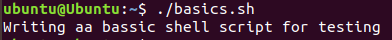

# Shell Scripting 

## TABLE OF CONTENTS

- Variables
- Conditional Statements
- Passing Arguments to Script
- Read User Input
- Loops
- Functions

## INTRODUCTION

- **_What is SHELL ?_**

  - A shell is a text-based command **interpreter** that acts as a bridge between the user and the system, translating input commands into instructions the operating system understands.
  - **Examples:**
    - The Bourne Shell (**sh**)
    - The GNU Bourne-Again Shell (**bash**)
    - The Z Shell (**zsh**)

- **_Problem_**
  - Maintaining consistency across multiple servers through manual configuration can be exhaustive and error-prone, especially when dealing with intricate command sequences. Re-executing hundreds of individual commands becomes impractical and susceptible to human error.s
- **_Solution_**

  - Shell script files (**.sh**) offer a powerful solution to this challenge. By grouping all necessary commands into a single script, you can streamline and automate the configuration process. Executing the script once applies the entire configuration to your server, saving time and ensuring consistency.

## BASICS: Create a simple Shell Script

1. **_Script Creation_**:
   - Start your shell scripting adventure by creating a new text file. Following typical conventions, add the .sh extension to denote its purpose. This file will serve as the roadmap for your scripts.
     - 
2. **_Building Blocks_**:
   - Open your newly created file using a text editor and start constructing your script. Begin with the **shebang** line, denoted by **#!** followed by the path to your chosen shell interpreter (e.g., #!/bin/bash). This line instructs the operating system how to process and execute the script.
   - Next, employ the echo command to display messages in the console.
     - 
3. **_Enabling Script Execution_**
   - Recall that shell scripts are meant to be actionable. To activate your script, grant it executable permissions using the chmod command. For instance, _chmod +x basics.sh_ empowers the file basics.sh for execution. .
     - 
   - Verify the permission change using ls -l, ensuring the presence of "x" in the permissions section.
     - 
4. **_Running the Script_**
   - Navigate to the directory containing your script using the cd command. Now, initiate the script by typing its name (e.g., ./basics.sh) and pressing Enter. Observe the script execute the defined commands, leaving its mark on the system.
     - 

## VARIABLES

1. **_Defining variables:_**
   - variable_name=value
   - 
2. **_Accessing variables:_**
   - 
   - 
3. **_Unsetting variables:_**
   - 
   - 
4. **_Command Substitution:_** Need the output of a command as a variable's value? Command substitution makes it possible:
   - 
   - 

## CONDITIONAL STATEMENTS

- Conditional statements, often referred to as **if statements**, are fundamental building blocks in Shell Scripting. They allow you to control the flow of your script based on specific conditions, making it adaptable and efficient.
- Syntax:

  - 
  - Use **if** to start the statement, followed by a condition (expression between square brackets) to evaluate.
  - Place commands indented under if to execute if the condition is true.
  - Use **elif** for additional conditions, else as a fallback if none match.
  - End with **fi** to mark the end.

- Expressions:
  - Conditions within if statements are often made up of expressions enclosed in square brackets. These expressions can involve:
    - **Arithmetic operations**: +=, -=, \*=, /= (e.g., count=$((count+1)))
    - **Comparisons**: ==, !=, <, >, <=, >= (e.g., if [[-f $file]]; then ...)
  - https://www.gnu.org/software/bash/manual/html_node/Bash-Conditional-Expressions.html

## PASSING ARGUMENTS TO SHELL SCRIPTS

- Arguments act as additional data points passed when you run the script, empowering it to handle diverse scenarios and personalize its behavior.

- **_Positional Arguments: $1, $2, ..., $9_**

  - When you run your script, the first argument goes into $1, the second into $2, and so on, up to $9.
  - 
  - 

- **_All in One: $\*_**
  - Sometimes, you might need to process all arguments together. That's where **_$\*_** comes in handy. It captures all arguments into a single space-separated string.
  - 
  - 
- **_Knwoing Limits: $#_**
  - **_$#_** holds the total number of arguments passed.
  - 
  - 
- **_Capturing Execution Status: $?_**
  - **_$?_** captures the value returned by the last command.
