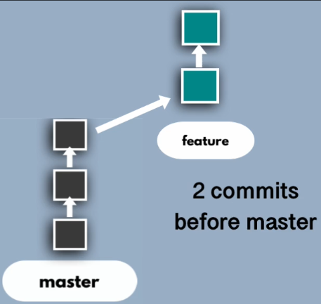
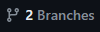
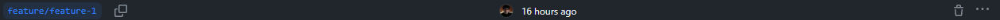
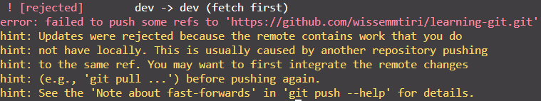
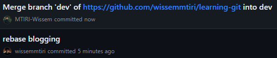

# Version Control With Git 

## Basic Concepts:

- **Git != Github**:

  - **_Git_** version control system, a software tool for tracking changes made to files over time. Think of it like a record player keeping track of where the needle is on a record, allowing you to jump back and forth between different versions of your code.
  - **_Github_** web-based hosting platform for Git repositories. Think of it like a library where you can store your record collection (Git repositories) and easily access and share them with others.

- **Working Directory**

  - It's the main hub of your local project, containing all the files and folders that make up your project at any given point. Think of it as your personal playground where you can make changes, experiment, and collaborate before sharing with others.

- **Staging Area**

  - The bridge between your local working directory and the final commits you make to the remote repository. It's not a physical location but rather a conceptual space where you gather the specific changes you want to include in your next commit.

    Think of it like a staging area for actors before a play - you decide who (changes) will be on stage (in the commit) for the audience (remote repository).

- **Local Repository**

  - a local repository in Git exists solely on your individual computer. It serves as your personal workspace for cloning, making changes to, and managing a Git project. Think of it as your own copy of the project, where you can experiment, develop, and commit changes before pushing them to collaborate with others on a remote server.

- **Remote Repository**
  - A remote repository ,often just called a "remote", is a copy of your Git project hosted on a different server, typically somewhere on the internet. It acts like a central hub where you can push local changes made to your project and pull updates from others who are collaborating on it.

## Commands

- **git clone**
  - Creates a local copy of an existing Git repository stored on a remote server.
  - Example: _git clone https://github.com/wissemmtiri/project.git my-local-project_
- **git init**
  - Initializes a new Git repository in your current directory. This essentially creates a hidden directory called .git where Git stores all the information about your project's history, including versions of your files, commit messages, and branch information.
  - Command: _git init_
- **git add**
  - Selects changes from your working directory to be included in the next commit.
  - Example: _git add main.py_ or _git add ._
- **git commit**
  - Captures the staged changes in the staging area, creating a permanent snapshot of your project's state.
  - Example: _git commit -m "Fixed bug in main function"_
- **git push**
  - Uploads your local commits to a remote repository for sharing and collaboration.
  - Command: _git push_
- **git log**
  - Displays the history of commits made to the repository.
  - Command: _git log_
- **git status**
  - Shows the current state of your working directory and staging area.
  - Command: _git status_

## Setting up a git repo

### _If the remote repository already exists_

1. _git clone https://github.com/wissemmtiri/repo.git project_name_
   1. project_name: name of the local repository
2. _cd project_name_

### _If the code is local and no remote repo is initialized_

1. _git init_
   1. creates a _.git_ directory in the working directory
2. _git add ._
3. _git commit -m "comment"_
4. create a remote repository in the preferred hosting platform (Github)
5. _git remote add origin https://github.com/wissemmtiri/repo.git_
   1. link the local repository with the remote repo
   2. origin: label given to the remote repo to help easily reference.
6. _git branch -M main_
   1. create a branch
7. _git push -u origin main_

## Branches Concept

- **_Definition_**

  - A lightweight pointer to a specific commit in your repository's history. It serves as a named divergence from the main development line, allowing you to experiment with changes, fix bugs, or develop new features without affecting the main branch. Think of it as a parallel path you can create and work on independently, eventually merging it back into the main road when your changes are ready.

- **_Commands_**

  - _git branch_
    - Lists all existing branches in your local repository.
  - _git pull_
    - Retrieves changes from the remote repository and merges them into your current branch.
  - _git checkout branch-name_

    - Switches your working directory to the specified branch.

  - _git checkout -b branch-name_
    - Creates a new branch locally and switches to it in one step.
  - _git push --set-upstream origin branch-name_
    - Creates and sets an upstream branch for a locally created branch, enabling easy pushing to the remote.

- **_Best Practises_**
  - create a branch for every feature and every bugfix
    - for features: feature/name
    - for bugfixes: bugfix/name

## Pull Requests

- **_Definition_**
  - They act as formal proposals to integrate changes from one branch into another, typically the main branch. This provides a controlled and transparent way to review and discuss potential changes before they become permanent.
- **_Use cases_**
  - Junior Dev, Big Features, Expertise needs
- **_How_**

  - The functionality for creating and reviewing merge requests typically resides within specific platforms or Git hosting services like GitHub, GitLab, or Bitbucket.
    - _It is not recommended to use CLI for pull requests_

  1. **_Ensure your branch is ahead of the main branch_**: This means your branch contains newer commits that aren't present in the main branch.
     1. 
  2. **_Access the pull request functionality on your chosen platform_**
     1. 
  3. **_Fill out the form_**
     1. 
  4. **_Your request will be visible to designated reviewers or the wider team, based on your workflow._**
  5. **_Acceptance and merging_**: Once the code is deemed ready, designated reviewers or merge approvers will integrate your changes into the main codebase.

- **_NB_**
  - Merge requests are more than just code integration, they're a collaborative learning and optimization opportunity.

## Deleting Branches

- **_Delete a branch or leave it ?_**
  - If the changes from the branch have been merged into the main branch, the branch is no longer needed and **deleting** it helps declutter your repository.
  - If you are unsure whether you might need the branch again, or the branch is part of a bigger development process, **retain it** until the process is complete.
- **_Delete on the remote repo_**

  - **use GUI:**
    - **_Navigate to the branches section_**
      - 
    - **_Locate the branch you want to delete_**
      - 
    - **_Click delete branch_**
      - 

- **_NB_**: The local repo will not be notified about the deleted branch. We need to delete it manually.

- **_Delete locally_**
  - _git checkout main/master_
  - _git pull_
  - _git branch -d branch-name_

## Streamline Your Git Workflow: Ditch Merge Commits with Rebasing

- **_Introduction_**

  - Ever feel frustrated by cluttered Git histories with merge commits littering your branches? You're not alone! While merges are essential for integrating changes, they can create messy logs that hinder collaboration and clarity. Enter the power of rebasing, a technique that rewrites history for a cleaner, linear Git experience.

- **_Scenario_**

  - Imagine you're part of a dynamic development team working on a new feature. You diligently craft your feature branch, committing changes for UI design, core functionality, and bug fixes. Meanwhile, the main branch receives valuable updates and bug fixes from your teammates.

- **_Clash of Branches_**

  - Attempting to push your feature directly leads to an error: "remote contains work that you do not have locally."
    - 
  - The traditional solution involves pulling the latest changes and then pushing your work, resulting in two commits: one for your feature and another for the merge.
    - 

- **_Rebase to the Rescue_**
  - Instead of creating merge clutter, consider rebasing your feature branch onto the updated main branch using _git pull -r_. This command:
    - Fetches updates from all remotes (not just the default).
    - Attempts to integrate those updates into your current branch.
  - If integration is seamless, your feature branch seamlessly aligns with the latest changes, resulting in a single, linear history devoid of merge commits.
    - 

## Merge Conflicts

- **_Introduction_**
  - Merge conflicts arise when distinct modifications are made to the same code lines across different branches. This results in Git identifying conflicting sections, presenting developers with a "battlefield" of conflicting versions. Each version, designated as "theirs" and "yours," requires careful analysis and integration.
- **_Solutions_**
  - **Manual Resolution**: The traditional approach involves meticulous examination of both versions within a text editor. Selecting the optimal components from each and merging them into a single, cohesive line constitutes the core strategy.
  - **Merge Tool Expertise**: Many modern IDEs and Git clients offer sophisticated visual merge tools. These interactive interfaces facilitate intuitive conflict resolution, often presenting side-by-side comparisons and allowing for streamlined merging.
    - 
