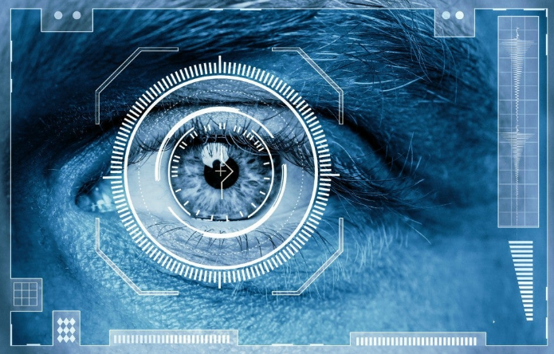
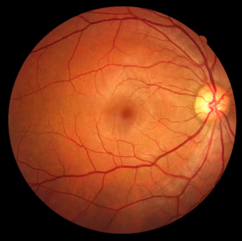

# Beyond Fingerprints: Your Eyes Hold the Key to Secure Access

## **Introduction**

In a world where cyber attacks are getting wider, and more target-specific, the quest of perfect authentication method rages on. **Passwords**? Forgettable. **Facial Recognition**? Biased. **Fingerprints**? Hacked.

**But what if the key to unlocking your identity lay not in your hand, your face, or your mind, but deep within your very own eyes?**

## **Your Unique Retina**

Imagine a vibrant tapestry woven from delicate blood vessels, each branching and intertwining in a unique pattern. This intricate artwork isn't found in a museum, but nestled deep within your eye, on a layer called the retina. This light-sensitive membrane is responsible for converting light into electrical signals, allowing you to see the world around you. But unbeknownst to most, the retina also holds a hidden secret – a vascular map as individual as your fingerprint.

 

## **How it works**

### **1. Capturing the signature of the Eye**

The magic of retinal authentication begins with a specialized technique known as near-infrared (NIR) ophthalmoscopy. This technology bathes the retinal microvasculature in invisible NIR light, which penetrates the superficial layers and reflects off the underlying blood vessels. The reflected light, captured by a sensitive sensor, paints a detailed digital portrait of your unique vascular landscape.

### **2. Feature Extraction and Encoding**

This captured image, however, is not merely a visual representation. Sophisticated algorithms, meticulously analyze the intricate patterns of bifurcations, anastomoses, and vessel calibers within your retinal microvasculature. These unique features, analogous to landmarks on a map, are then extracted and mathematically encoded into a template, your personal "**retinal signature**." This template, houses the cryptographic key to your identity.

### **3. Matching Patterns with Precision**

When authentication is required, the process enters a new phase. A second NIR scan captures your current retinal image, and its extracted features are compared to your stored template. If the patterns match within a predefined threshold, access is granted! Essentially, the system recognizes your eye as the biometric key, unlocking the door to secure environments.

## **Limitations and Challenges**

### **Technical Hurdles:**

- **Accuracy and environmental factors**: External factors like lighting conditions, contact lenses, or even slight eye movements can impact scan accuracy, potentially leading to false positives or negatives.
- **Device limitations**: The quality and sensitivity of the scanning devices play a crucial role in accuracy. Lower-end scanners might struggle with capturing intricate details, impacting reliability.
- **Template vulnerability**: If the stored template is compromised through hacking or data breaches, it could pose a significant security risk. Robust encryption and secure storage protocols are essential.

### **Ethical Considerations:**

- **Privacy concerns**: Retinal scans capture sensitive biometric data, raising concerns about data privacy and potential misuse. Strict regulations and user consent are crucial for ensuring ethical data handling.
- **Accessibility and discrimination**: Not everyone can utilize retinal scanners due to physical limitations or disabilities. Additionally, concerns exist about potential discrimination based on inherent physiological characteristics.
- **Surveillance and social implications**: The widespread adoption of retinal scanning could raise concerns about increased surveillance and potential misuse by governments or private entities.

### **Other Limitations**

- **Cost**: High-quality retinal scanners can be expensive, limiting their accessibility in certain contexts.
- **User acceptance**: Some individuals might find the scanning process intrusive or uncomfortable, impacting their willingness to adopt this technology.
- **Limited applications**: While effective for access control and high-security environments, retinal scanning might not be suitable for all authentication scenarios.
